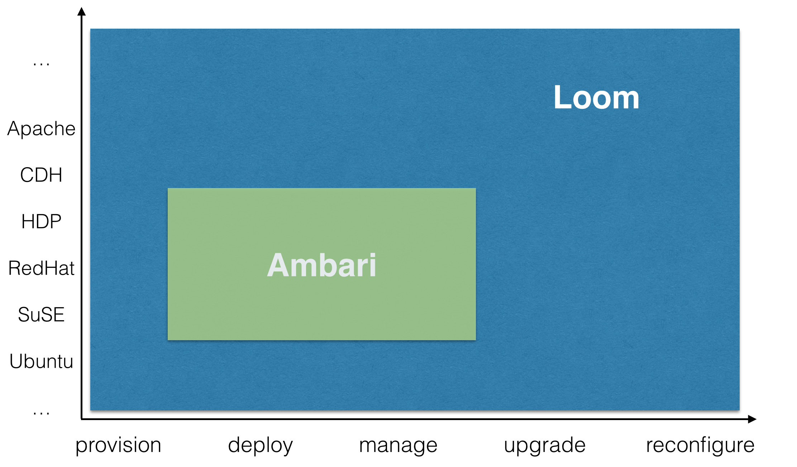

..
   Copyright 2012-2014, Continuuity, Inc.

   Licensed under the Apache License, Version 2.0 (the "License");
   you may not use this file except in compliance with the License.
   You may obtain a copy of the License at
 
       http://www.apache.org/licenses/LICENSE-2.0

   Unless required by applicable law or agreed to in writing, software
   distributed under the License is distributed on an "AS IS" BASIS,
   WITHOUT WARRANTIES OR CONDITIONS OF ANY KIND, either express or implied.
   See the License for the specific language governing permissions and
   limitations under the License.

:orphan:

.. _faq_toplevel:

.. index::
   single: FAQ: General

====================================
General
====================================

What are the differences between Continuuity Loom and Ambari/Savanna?
---------------------------------------------------------------------

From the `Apache Ambari <http://ambari.apache.org/>`_ site:

.. epigraph:: "The Apache Ambari project is aimed at making Hadoop management simpler by developing software for provisioning, managing, and monitoring Apache Hadoop clusters. Ambari provides an intuitive, easy-to-use Hadoop management web UI backed by its RESTful APIs."

From the `Savanna <https://savanna.readthedocs.org/en/latest/>`_ site:

.. epigraph:: "Savanna project aims to provide users with simple means to provision a Hadoop cluster at OpenStack by specifying several parameters like Hadoop version, cluster topology, nodes hardware details..."

Even though Continuuity Loom may seem similar to Apache Ambari and Savanna in some aspects, it is vastly different in terms of functionality and system capabilities.

The graph above depicts Continuuity Loom's management capabilities on the horizontal scale, and the table below differentiates the high level features absent in Apache Ambari and Savanna:

.. list-table::
   :widths: 15 10 15 25
   :header-rows: 1

   * - Feature
     - Continuuity Loom
     - Ambari/Savanna
     - Description
   * - Multi Cluster support
     - Y
     - N
     - Ambari/Savanna offers limited support in the backend, and Ambari limits to single cluster in the frontend.
   * - Private or Public Cloud support
     - Y
     - N
     - No provisioning capability in Ambari. Savanna supports provisioning, but both are limited only to Hadoop clusters.
   * - Support for other OS
     - Y 
     - N
     - Only supports RHEL and SuSE. More information `AMBARI-1241 <https://issues.apache.org/jira/browse/AMBARI-1241>`_ and `AMBARI-660 <https://issues.apache.org/jira/browse/AMBARI-660>`_
   * - Support any distribution of Hadoop 
     - Y
     - N
     - Ambari only supports HDP, `AMBARI-3524 <https://issues.apache.org/jira/browse/AMBARI-3524>`_
   * - Support for any automation system
     - Y
     - N
     - Ambari only supports Puppet. Continuuity Loom can support any automation framework through :doc:`Provisioner Plugins </guide/admin/plugins>`
   * - Cluster template support 
     - Y
     - Y/N
     - Ambari supports blueprints after the cluster is available for further management. Unlike Continuuity Loom, it does not use templates to create clusters. Savanna, on the other hand, does support, but it requires node groups to be explicitly defined for placing services on each node group. Continuuity Loom offers a built-in logic for solving the service placement through a layout planner.
   * - Consistency Guarantees
     - Y
     - N
     - Ambari does not guarantee consistency in case of failures during provisioning. In contrast, Continuuity Loom layout planner DAG executioner ensures consistency by transacting operations on the cluster.

Does Continuuity Loom work with Ambari?
---------------------------------------
Currently there is no integration with Ambari. There are plans to add a feature for Continuuity Loom to export templates that are compatible with Apache Ambari blueprints. When this compatibility feature is
completed in Ambari, you may be able to work with these templates. Please refer to `AMBARI-1783 <https://issues.apache.org/jira/browse/AMBARI-1783>`_ for more information.

What are the differences between Continuuity Loom and Amazon EMR?
-----------------------------------------------------------------
Amazon EMR provides a subset of Hadoop services (such as Hive, Pig, HBase, and MapReduce) and manages 
jobs and workflows on top of those services. Continuuity Loom, on the other hand, is a software agnostic, generic system for
creating clusters of any layout and of any type. Being software agnostic and a provisioning tool, Continuuity Loom has no direct support
for managing jobs on clusters, as its focus is on cluster creation and management, not jobs and workflow management.

Will Continuuity Loom support `docker <http://docker.io>`_ based clusters?
---------------------------------------------------------------------------
We believe in the potential of docker based clusters. In the future releases, we plan to support Docker based clusters.

Does Continuuity Loom support bare metal?
------------------------------------------
Not at the moment, but there are plans to add resource pools in a future release. With resource pools, Continuuity Loom would manage
pre-existing machines instead of creating them from scratch each time a new node is needed. Resource pools would also
introduce the ability to manage bare metal.

What providers are supported by Continuuity Loom?
-------------------------------------------------
Out of the box, Continuuity Loom supports Rackspace, Joyent, Openstack (fog compatible). Plugins
for EC2, HP Cloud, Cloudstack, Azure, BlueBox, GCE, CloudFoundry, and Terremark are planned. Contributions here
are welcome and encouraged!

Does Continuuity Loom make it easy for me to migrate from one cloud to another?
--------------------------------------------------------------------------------
Absolutely. When we originally built Continuuity Loom at Continuuity, the main goal was to make it a seamless process to migrate from
one cloud to another.

Can Continuuity Loom work on my laptop?
----------------------------------------
Continuuity Loom has been tested on OSX Mavericks. There are plans to add Windows support in a future release, but until then
Windows users will have to use the usual workarounds, such as using Cygwin.

How long has Continuuity Loom been used in a production environment and where is it being used?
------------------------------------------------------------------------------------------------
A previous version of Continuuity Loom has been running in production at Continuuity since Feb 2012.

Is Continuuity Loom designed only for provisioning compute and storage?
------------------------------------------------------------------------
Continuuity Loom is a generic provisioning coordination system, and it can be used for provisioning more than
just compute and storage. Though Continuuity Loom has not yet been tested, the architecture supports provisioning
and configuring of other resources. Please refer to the :doc:`Provisioner Plugins</guide/admin/plugins>` page
for more details on how to write plugins for provisioners to support Providers and Automators that can provision and 
configure different resources.

What is the recommended setup for Continuuity Loom in terms of hardware and configuration?
-------------------------------------------------------------------------------------------
We recommend the following :doc:`deployment configuration </guide/recommended-deployment>` for a production environment that includes
HA for persistence store, multiple nodes for Zookeeper, and HA proxy for traffic distribution across UIs and provisioners.

Does Continuuity Loom support monitoring and alerting of services deployed?
---------------------------------------------------------------------------
Currently, it does not; however, another system within Continuuity named Mensa (A monitoring and alerting system) is being integrated
into Continuuity Loom to support monitoring and alerting.

Does Continuuity Loom support metering?
---------------------------------------
For each account, and the templates from which it provisions resources, Continuuity Loom internally keeps track of clusters, resources, and services. This information
will be exposed through the administration interface in the next release.

I use puppet. Will I be able to use puppet with Continuuity Loom?
------------------------------------------------------------------
Yes. Continuuity Loom is a smart orchestration layer with open support for integrating any automation framework. You can use your puppet modules
to configure clusters. Please refer to the :doc:`Administration Guide </guide/admin/index>` for more details on how to integrate.

Can Continuuity Loom support approval workflows or the ability to pause provisioning for approval?
--------------------------------------------------------------------------------------------------
The current version of Continuuity Loom does not support it, but it will be very easy to add a cluster provisioning state for approval or pausing.

